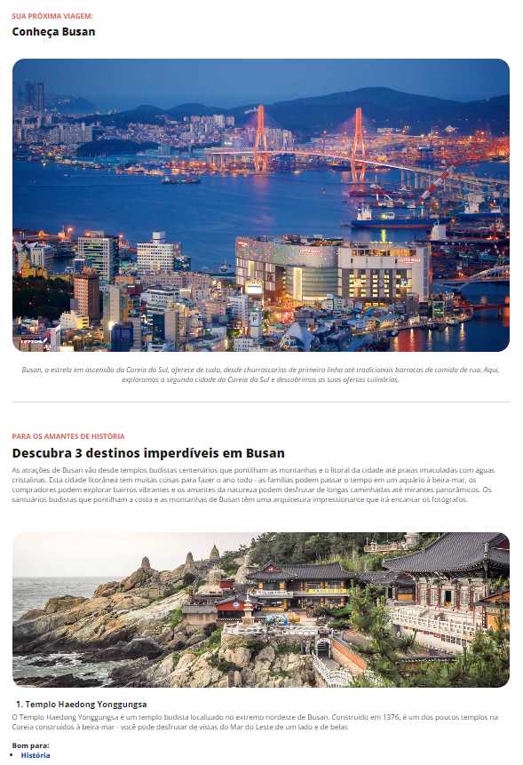

## 
 Local turístico 

<b>TÓPICOS</b>

 

<a href="#-tecnologias">TECNOLOGIAS</a> | 
<a href="#️-ferramentas">FERRAMENTAS</a> |
<a href="#️-estrutura">ESTRUTURA</a> |
<a href="#-apresentação">APRESENTAÇÃO</a> |

---

Projeto desenvolvido para explorar habilidades absorvidas durante o curso <b>Fullstack - Rocketseat</b> - iniciando HTML e CSS

## 🤖 TECNOLOGIAS

Neste momento do projeto foram utilizadas apenas as tecnologias de HTML e CSS puros sem uso de frameworks ou ferramentas auxiliares para execução.

## ⚒️ FERRAMENTAS

Para o inicio do escopo, apresentando a ideia inicial foi utilizando o <a href="https://www.figma.com/design/rLmcCkGh6R5Xmha8oGBaWj/Local-Tur%C3%ADstico-(Community)-(Copy)?node-id=3-376&t=d8Ih3jOzFg3m37Tt-1-"> <b>Figma</b> </a> para realizar o desenho e layout do projeto, tirando do papel e adaptando ao digital.  
Com essa ferramenta foi possível apresentar o modelo do layout no projeto.
 
Iniciando na parte dos códigos, foi utilizado o <b><a href="https://vscode.dev/">VScode</a></b> devido a sua variedade de opções e aplicativos que auxiliam na proatividade do projeto.

## 🏗️ ESTRUTURA

A página possui uma estrutura básica somente para aplicar fundamentos iniciais.  

## 📺 APRESENTAÇÃO

 
